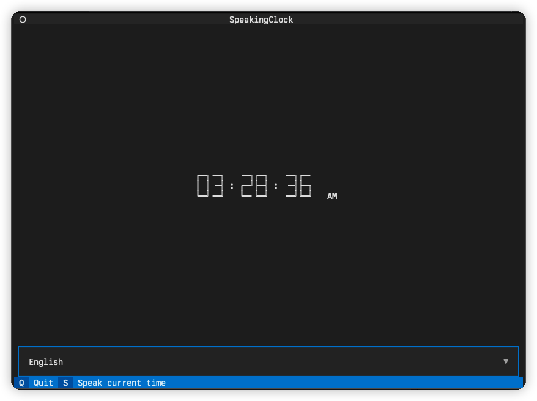

## Introduction to TUI (Terminal User Interface)

TUI stands for Terminal User Interface. While many might be more familiar with GUIs (Graphical User Interfaces), a TUI provides an alternative that operates within a terminal or command-line environment. For our project, we chose to implement a TUI version of a talking clock alongside a WebUI. Given the simplicity of the project, having a TUI version ensured that all three experienced developers in our team could actively participate and contribute. Moreover, it offers us a chance to interact with a talking clock directly from the terminal, showcasing the versatility of terminal-based applications. 

## Prerequisites

### System Dependencies

To audibly announce the time, our program requires command-line tools capable of playing .wav or .mp3 files:

- **Mac OS**: 
  
  Built-in player: `afplay`. No additional installations are needed.

- **Linux**:

  We utilize the `play` command from [SoX](https://arielvb.readthedocs.io/en/latest/docs/commandline/sox.html). Detailed installation instructions can be found on the provided link.

- **Windows**:

  We suggest using [WSL (Windows Subsystem for Linux)](https://learn.microsoft.com/en-us/windows/wsl/install) and then follow the Linux installation guidelines.

### Python Requirements

The necessary Python libraries for this project have been specified in `requirements.txt` within the `tui` folder. Install them using:
```shell
pip install -r requirements.txt
```

## Usage

To execute the program, simply run:

```shell
python tui.py
```



Upon execution, the current time will be prominently displayed in the terminal's center. Users can select the desired language via the selector at the bottom. The selected language will influence the audible announcement of the time. We employ [`gTTs`](https://github.com/pndurette/gTTS) for text-to-speech functionality. Currently, there are only two ways to interact with this application as showing on the footer of it: press `s` to speak current time or press `q` to quit it.

### Advanced: Audio Mashup

For advanced users, our program supports the use of custom audio recordings to override the default TTS engine. This is achieved through a mashup strategy grounded in linguistic principles. For instance, to substitute the default English TTS with custom recordings, use:

```shell
python tui.py en=audios/en
```

Here, `en` is the language code for English. We predominantly follow the [ISO-639 code](https://www.iso.org/iso-639-language-codes.html) standards, with some exceptions adhering to [BCP 47](https://www.rfc-editor.org/info/bcp47). This command specifies that the program will use the audio recordings from the `audios/en` directory to create a mashup, which will then serve as a replacement for the default gTTS English output.

## Limitations

The TUI version of our talking clock has certain constraints compared to its WebUI counterpart. It currently lacks features like TTS speed adjustment and time modification. Furthermore, it also lacks the potential of integrating more functionalities and AI features. The TUI approach, while appealing to tech enthusiasts, is inherently more basic and rigid. Nonetheless, it offers us a chance to interact with a talking clock directly from the terminal.